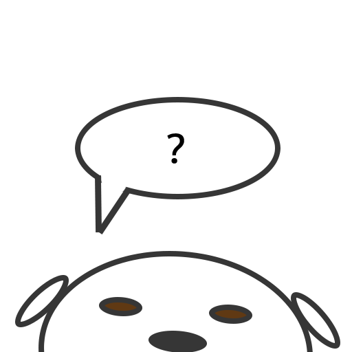

# Developer Dog

Dogs are on the whole wonderfully good and, perhaps, the best companions of humankind. Becoming a developer can be a bit tricky, so this Alexa Skill (modified from the Space Facts Template) will provide dog-themed encouragement.

## Usage

- `Alexa, open Developer Dog`
- `ask Developer Dog for motivation`

## Development

- `git clone`
- `npm install`
- `npm run build`
- upload your `build/bundle.zip` to your lambda function via [AWS Lambda Console][aws-lambda-console]

## Note: External Content

This skill makes use of [node-fetch][node-fetch] to pull some JSON of additional "facts" beyond the statically defined set, which is used as a fallback in the event of network request failure. This can be found [where it lives][json-alt-host].

## Credits

- [Amazon Aelxa Node SDK](http://npm.im/alexa-sdk)
- Dogs everywhere, they're all good boys and girls
- Developers, keep on learnin' and giving belly rubs!

## License

MIT

[aws-lambda-console]: https://console.aws.amazon.com/lambda/home
[json-alt-host]: https://github.com/edm00se/edm00se.github.io/blob/master/devDogFacts.json
[node-fetch]: http://npm.im/node-fetch
